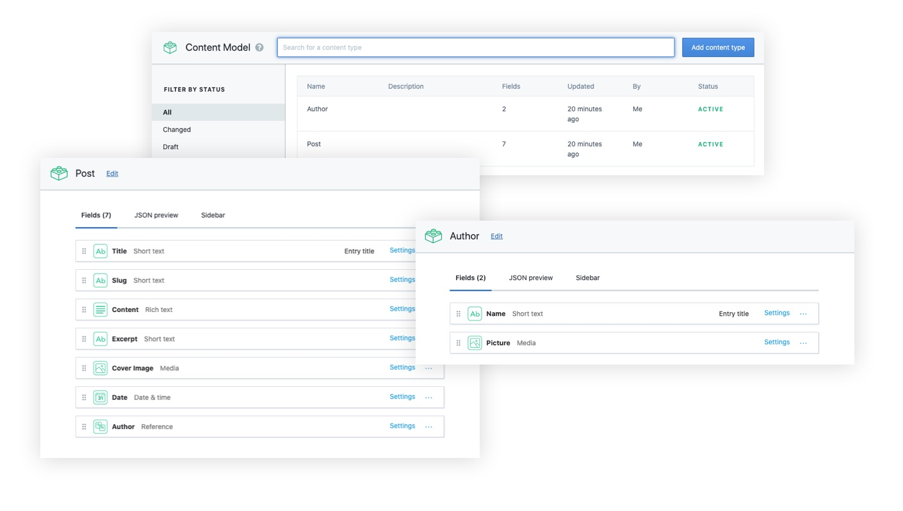
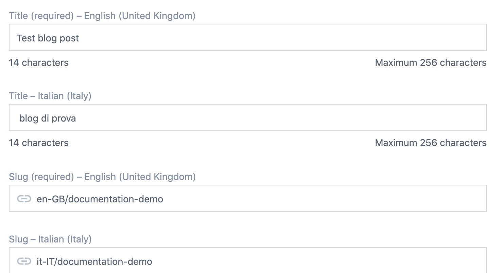
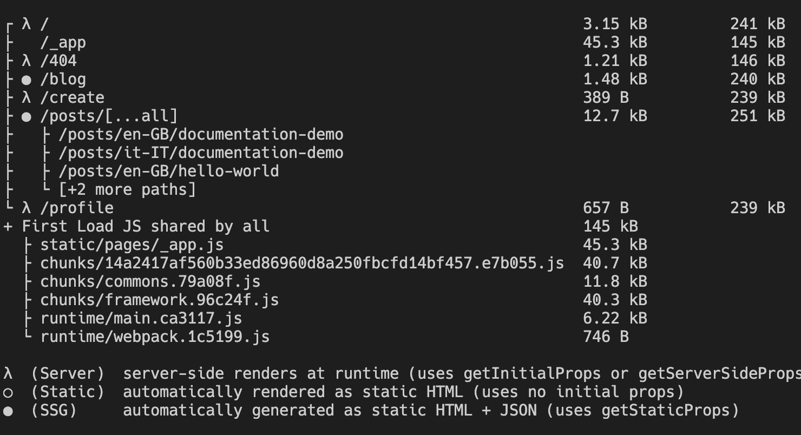
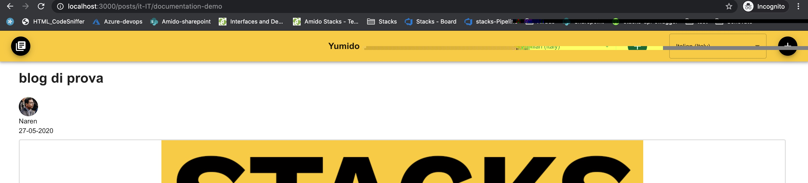

# Content Management System

This implementation showcases NextJS's Static Generation feature using
[Contentful](https://www.contentful.com/) as the data source.

## Tools used

- [Contentful](https://www.contentful.com/)
- [Rich-text-react-renderer](https://www.npmjs.com/package/@contentful/rich-text-react-renderer)
- [NextJS-Pre Rendering](https://nextjs.org/docs/basic-features/pages#pre-rendering)

## Configuration

### Step 1. Create an account and a space on Contentful

1. First,
   [create an account on Contentful](https://www.contentful.com/sign-up/).

2. After creating an account, create a new empty **space** from the
   [dashboard](https://app.contentful.com/)

3. Create the
   **[Content Delivery API](https://www.contentful.com/developers/docs/references/content-delivery-api/) -
   access token** field of your API key

4. Create the
   **[Content Preview API](https://www.contentful.com/developers/docs/references/content-preview-api/) -
   preview token** field of your API key

### Step 2. Create a content model

The Stacks Yumido example uses the following content model:

#### **Author**

- `name` - **Short text** field
- `picture` - **Media** field

#### **Post**

- `title` - **Text** field (type **short text**)
- `content` - **Rich text** field
- `excerpt` - **Text** field (type **short text, full-text search**)
- `coverImage` - **Media** field (type **one file**)
- `date` - **Date and time** field
- `slug` - **Text** field. You can optionally go to the settings of this field,
  and under **Appearance**, select **Slug** to display it as a slug of the
  `title` field.
- `author` - **Reference** field



### Step 3. Populate content

**Important:** For each entry and asset, you need to click on **Publish**.

## To Run

```bash
npx cross-env NEXT_PUBLIC_CONTENTFUL_SPACE_ID=<YOUR_SPACE_ID> \
NEXT_PUBLIC_CONTENTFUL_ACCESS_TOKEN=<ACCESS_TOKEN> \
NEXT_PUBLIC_CONTENTFUL_PREVIEW_ACCESS_TOKEN=<PREVIEW_TOKEN> \
```

### References

### [https://next-blog-contentful.now.sh/](https://next-blog-contentful.now.sh/)

## Localization and Internationalization

Stacks relies on
[contentful](https://www.contentful.com/developers/docs/tutorials/general/setting-locales/)
to supplies the locales needed for translations.

### For the purposes of demo

- Two locales have been created in Contentful (_en-GB_ and _it-IT_)
  
- Each post and field entry would contain 2 locales _for eg. slugs are prefixed
  with_ _en-GB_ and _it-IT_.
  
- NextJS static page generator builds dynamic pages and paths using the slug
  data. 
- Added a language switcher in the blog post pages in the header. The switcher
  will update the URL to relative prefixed path for _eg:
  /posts/it-IT/documentation-demo_ refer the image below
  

---

## ⚠️ Important 👷‍♀️🚧

> Please note CMS is an optional feature included in the Stacks workspace. To
> turn off CMS please remove the folder [/cms](../src/ssr/pages/cms) inside
> ssr/pages before building and make sure the tsconfig does not include these
> files.
